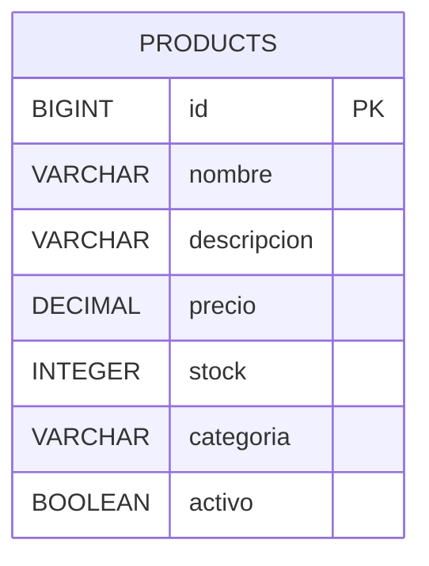

# Product Microservice (product-api v1)

## Descripción

Microservicio encargado de administrar el catálogo de productos del sistema.

Permite crear, consultar, actualizar y desactivar productos.

---

## Tech Stack

* Java 25
* Spring Boot 4.0.6
* Spring Security
* JWT
* Spring Data JPA
* MySQL
* Flyway
* Docker
* Maven

---

## Funcionalidades

* Crear productos
* Listar productos
* Buscar productos por ID
* Buscar productos por categoría
* Listar productos activos
* Actualizar productos
* Desactivar productos

---

## Modelo de Datos



---

## API / Endpoints

Base URL:

```txt
/api/v1/products
```

| Acción               | Método | Endpoint                                |
| -------------------- | ------ | --------------------------------------- |
| Crear producto       | POST   | `/api/v1/products`                      |
| Listar productos     | GET    | `/api/v1/products`                      |
| Listar activos       | GET    | `/api/v1/products/active`               |
| Buscar por ID        | GET    | `/api/v1/products/{id}`                 |
| Buscar por categoría | GET    | `/api/v1/products/category/{categoria}` |
| Actualizar producto  | PUT    | `/api/v1/products/{id}`                 |
| Desactivar producto  | DELETE | `/api/v1/products/{id}`                 |

---

## Ejemplo de Request

```http
POST http://localhost:8005/api/v1/products
```

Body:

```json
{
  "nombre": "Collar para perro",
  "descripcion": "Collar ajustable color rojo",
  "precio": 5990,
  "stock": 20,
  "categoria": "Accesorios"
}
```

---

## Ejemplo de Response

```json
{
  "id": 1,
  "nombre": "Collar para perro",
  "descripcion": "Collar ajustable color rojo",
  "precio": 5990,
  "stock": 20,
  "categoria": "Accesorios",
  "activo": true
}
```

---

## Variables de entorno

```env
SPRING_ENV=dev
SPRING_APP_NAME=Product

HOST_PORT=8005

MYSQL_DATABASE=db_products

SPRING_JWT_SECRET=secret-key
SPRING_JWT_ISSUER=login-service
```

---

## Ejecución

```bash
docker compose up -d
mvn spring-boot:run
```

---

## Seguridad

Los endpoints protegidos utilizan JWT.

Header:

```txt
Authorization: Bearer TOKEN
```

---

## Equipo

* Eduardo Bray
* Rodrigo Callealta
* Fernando Villalobos

> DuocUC — FullStack 1 © 2026
